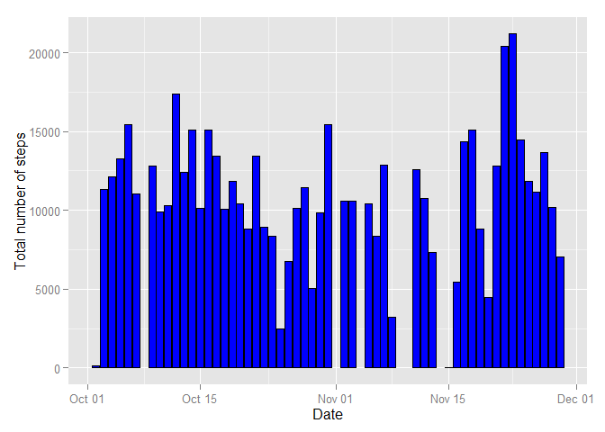
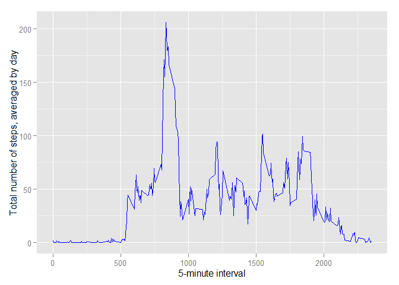
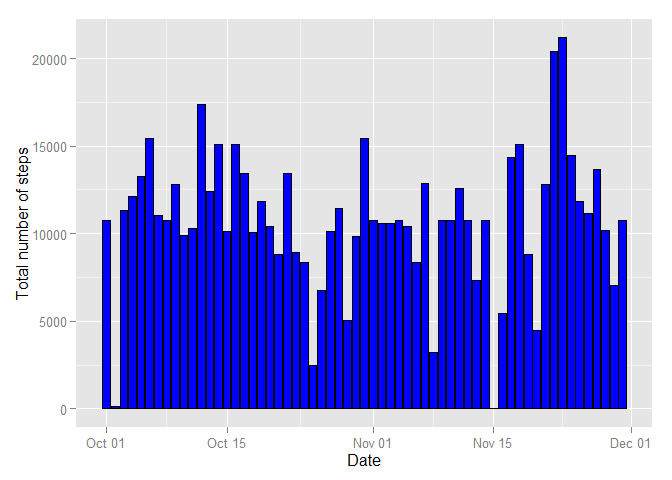
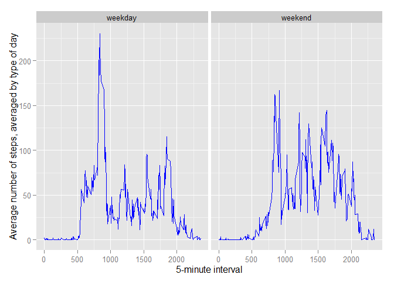

# Reproducible Research: Peer Assessment 1
Miguel Duarte  
Thursday, November 12, 2015  

  
First, we start configuring the settings for this assignment.


```r
# Setting locale for time to English
Sys.setlocale("LC_TIME", "C")

# Before running please set the folder where the "activity.csv" file is, as the working directory
# Please remember to have all your packages up-to-date

library(data.table)
library(ggplot2)
library(scales)
```

## Loading and preprocessing the data


```r
# Part 1: Loading and preprocessing the data

data <- fread("./activity.csv",sep=",",header=T)
data$date <- as.Date(data$date)
```

## What is mean total number of steps taken per day?


```r
# Part 2: Mean of the total number of steps taken by day

## Aggregate data un a new dataset called "steps1"
steps1 <- data[,lapply(.SD, sum, na.rm=TRUE),by=date,.SDcols="steps"]

## Plot histogram
ggplot(data, aes(x=date, y=steps, group=1)) +
  geom_histogram(stat='summary', fun.y=sum, colour="black",fill="blue") +
  xlab("Date") +
  ylab("Total number of steps")
```

```
## Warning: Removed 2304 rows containing missing values (stat_summary).
```

 

Now we calculate the mean and the median of the total number of steps taken per day.


```r
## Calculate mean and median of steps taken by day
mean(steps1$steps)
```

```
## [1] 9354.23
```

```r
median(steps1$steps)
```

```
## [1] 10395
```

## What is the average daily activity pattern?


```r
# Part 3: Average daily activity pattern

## Aggregate data from all the 5-minute intervals (288 in total) in a new dataset called "steps2"
steps2 <- data[,lapply(.SD, mean, na.rm=TRUE),by=interval,.SDcols="steps"]
#steps2$interval <- format(strptime(paste(floor(steps2$interval/100),steps2$interval%%100,sep=":"),format = '%H:%M'),format = '%H:%M')

## Plot time series 
ggplot(steps2, aes(x=interval, y=steps, group=1)) +
  stat_summary(fun.y=mean, geom="line", colour="blue") +
  xlab("5-minute interval") +
  ylab("Total number of steps, averaged by day") 
```

 

The interval which on average contains the maximum number of steps, across all the days in the dataset is:


```r
## Select interval with maximum number of steps
steps2[steps==max(steps2$steps),]
```

```
##    interval    steps
## 1:      835 206.1698
```

## Imputing missing values

For imputing the missing values, two alternatives were considered.  
The first one is using the mean across all the non-missing values of steps in the dataset. That means that every missing will be recoded with the **same** value. This approach was discarded because is too simplistic.  
The second alternative is, **for every interval**, using the mean of all the non-missing values of steps across all days. This way, the missing values will be recoded according to the interval they belong.


```r
# Part 5: Imputing missing values

## Counting NAs in every column
nrow(data[as.vector(is.na(data[,1,with=F])),1,with=F]) # 2.304 NAs in column 1
```

```
## [1] 2304
```

```r
nrow(data[as.vector(is.na(data[,2,with=F])),2,with=F]) # 0 NAs in column 2
```

```
## [1] 0
```

```r
nrow(data[as.vector(is.na(data[,3,with=F])),3,with=F]) # 0 NAs in column 3
```

```
## [1] 0
```

```r
## Create a copy of the dataset (whose missing values in column 1 will be imputed)
data2 <- data

## Create impute function
impute <- function(x,column) {

  # Display the value which will be imputed in the defined column (as an index)
  print(as.integer(round(mean(as.matrix(x[as.vector(!is.na(x[,as.integer(column),with=F])),as.integer(column),with=F])),0)))

  # Recode NAs with the imputing value in that column
  set(x,which(as.vector(is.na(x[,as.integer(column),with=F]))),as.integer(column),as.integer(round(mean(as.matrix(x[as.vector(!is.na(x[,as.integer(column),with=F])),as.integer(column),with=F])),0)))

}
```


```r
## Alternative 1: Impute NAs with the mean of steps taken over ALL the non-missing data  (rounded to integer value)
## impute(data2,1) # Too simplistic, it will NOT be used

## Alternative 2: Impute NAs with the mean of steps taken, by interval (rounded to integer value) 
data2 <- do.call(rbind,by(data2,data2[,"interval",with=F],function(x) impute(x,1),simplify = T)) # OK
```


```r
## Verify there is no NAs in the first column of the new dataset after imputation
nrow(data2[as.vector(is.na(data2[,1,with=F])),1,with=F]) # 0 NAs in column 1
```

```
## [1] 0
```

```r
## Aggregate data in a new dataset called "steps3"
steps3 <- data2[,lapply(.SD, sum, na.rm=TRUE),by=date,.SDcols="steps"]

## Histogram
ggplot(data2, aes(x=date, y=steps, group=1)) +
  geom_histogram(stat='summary', fun.y=sum, colour="black",fill="blue") +
  xlab("Date") +
  ylab("Total number of steps")
```

 

Now we calculate the mean and the median of the total number of steps taken per day, **after** imputing.


```r
## Calculate mean and median of steps taken by day
mean(steps3$steps)
```

```
## [1] 10765.64
```

```r
median(steps3$steps)
```

```
## [1] 10762
```

As we can see, the distributions before and after imputing clearly change. The impact of imputing missings is that the distribution of the total number of steps taken per day **moves to the right**, that is, we assumed that people with no information of steps on average take more steps than the people with information.  
As we already know, using the mean for imputation is **not** a very sophisticated strategy, even though we grouped by intervals in this case.

## Are there differences in activity patterns between weekdays and weekends?


```r
# Part 4: Differences in activity patterns between weekdays and weekends

## Create factor variable with days of the week (and a copy of it as an auxiliary variable)
data2$date_week <- as.factor(weekdays(data2$date))
data2$date_week2 <- data2$date_week

## Recode levels as "weekend" for "Saturday" and "Sunday", and "weekday" otherwise
levels(data2$date_week) <- c("weekday","weekday","weekend","weekend","weekday","weekday","weekday")

## Check the new levels are well assigned
table(data2$date_week,data2$date_week2)
```

```
##          
##           Friday Monday Saturday Sunday Thursday Tuesday Wednesday
##   weekday   2592   2592        0      0     2592    2592      2592
##   weekend      0      0     2304   2304        0       0         0
```

```r
## Delete auxiliary variable
data2$date_week2 <- NULL

## Plot panel data
ggplot(data2, aes(x=interval, y=steps, group=1)) +
  facet_grid(. ~ date_week) +
  stat_summary(fun.y=mean, geom="line", colour="blue") +
  xlab("5-minute interval") +
  ylab("Average number of steps, averaged by type of day")
```

 
